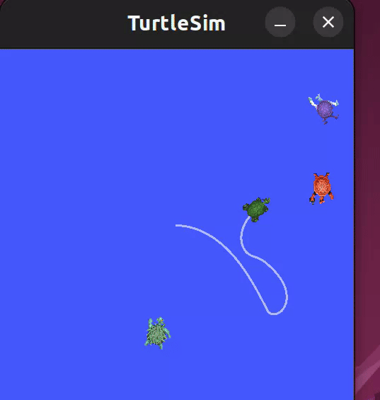

# ROS2 Turtle Catch Project 

## Overview

This project is a simulation built with **ROS2 Humble Hawksbill**. The goal of the project is to catch turtles using a robot within a **TurtleSim** environment. It involves custom ROS2 services, messages, and interactions between the robot and the simulated turtles. The project aims to catch nearest newly spawned turtles autonomously.

## Prerequisites

Make sure you have the following installed:

- **Ubuntu 22.04** (or another compatible version)
- **ROS2 Humble Hawksbill** (follow the official installation guide: https://docs.ros.org/en/humble/Installation/Ubuntu-Install-Debians.html)
- **Git** for cloning the repository

## Setup Instructions

### 1. Clone the Repository

First, clone the repository to your local machine:


git clone https://github.com/omkarakolkar/ros2-turtle-hunter.git
cd ros2-turtle-hunter

2. Install Dependencies

Install the required dependencies:
sudo apt update
sudo apt install -y python3-colcon-common-extensions

4. Source ROS2

Source the ROS2 environment:
source /opt/ros/humble/setup.bash

6. Build the Workspace

Build the ROS2 workspace using colcon:
colcon build --symlink-install

8. Source the Workspace

After building, source the local workspace:
source install/setup.bash

### Running the Project
To start the project, you can launch the turtlesim_catch_them_all.launch.xml file with the following command:

```bash
ros2 launch my_robot_bringup turtlesim_catch_them_all.launch.xml
```


